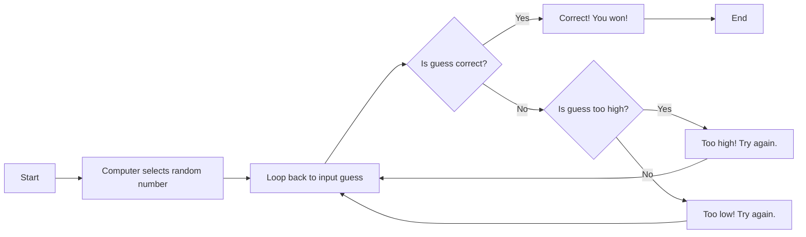

# gayathriashok4528.github.io

sashoknarayanan@my.waketech.edu  
My GitHub account's username is gayathriashok4528.  
I created the repository and named it after my username, checked the box for he README file and cloned it.  
I first downloaded GitHub on my laptop. I then logged into my account and clicked clone repository. I chose the location of the file and cloned it. 

# About Me  
## My Interests  
* I play the violin
* I volunteer at the community garden
* I like to hang out with my friends

## Websites I Recommend
* [Visit Britannica!](www.britannica.com)  This website is very helpful becase it provides me with a lot of accurate information about a wide range of topics.  
* [Visit Classical Music History!](www.classical-music.com)  I like this website because it gives me a lot of interesting facts about classical music.

## Description
The computer first selects a random number between 1-50. Then the user guesses a number, the program will then provide the user with feedbck telling them if their guess was too high, too low or correct. If their guess was not correct, the program loops back to where the user can guess again. However, if the user guesses correctly, the program will end.
